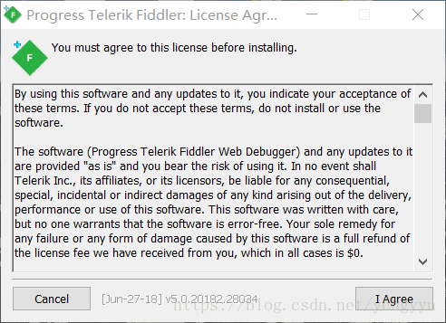
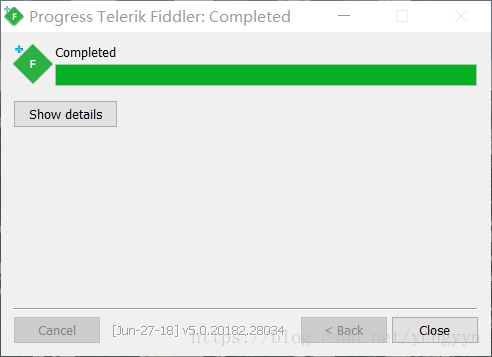
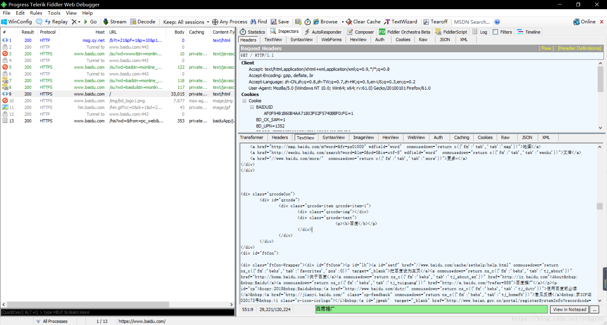
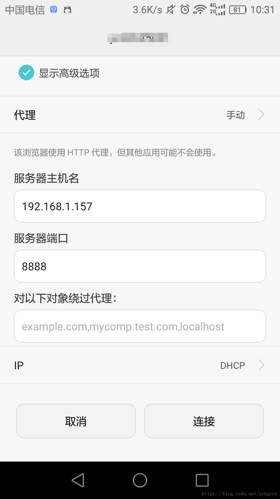
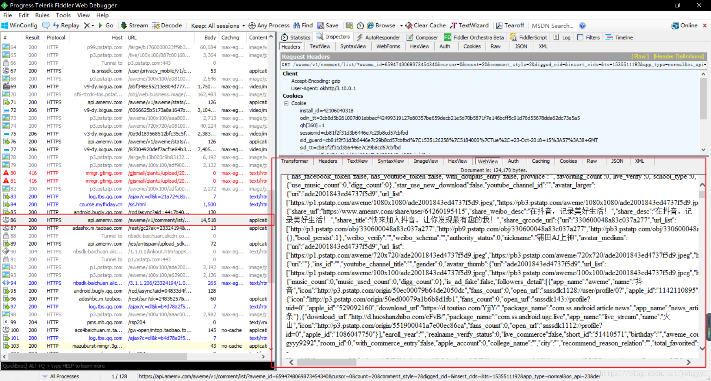

# Fiddler

## Fiddler的简介

* Fiddler是位于客户端和服务器端之间的代理，也是目前最常用的抓包工具之一 。它能够记录客户端和服务器之间的所有 请求，可以针对特定的请求，分析请求数据、设置断点、调试web应用、修改请求的数据，甚至可以修改服务器返回的数据，功能非常强大，是web调试的利器。

* 看到这么多的应用，是不是就迫不及待的想要开始你的抓包之旅呢，不要急，俗话说的好：工欲善其事，必先利其器，我们先来安装Fiddler吧。

## Fiddler的下载

* 打开官网，官网下载地址是[https://www.telerik.com/download/fiddler](https://www.telerik.com/download/fiddler)

* 打开以后选择你的相关信息如下图：

* 然后点击Download按钮开始下载

## Fiddler的安装

* 下载完成后双击安装包，如下图：

* 点击 `I Agree` 按钮，然后选择你想要存放的安装目录，如果不需要修改，使用默认的即可。

* 点击 `Install` 按钮，等待一会时间后即可安装成功。

* 点击 `Close` 按钮

* 到这里我们就初步安装成功了

## Fiddler的配置

### 电脑端监听

* 我们双击打开软件，进入到如下的一个界面，然后点击某一个请求，你会发现请求的内容是一堆明显不对的文字，然后该请求的左边是一个锁的样式，联想到https加密，你会发现原因可能是没有配置Fiddler。然后解释一下右边的默认返回内容，第一句是**“这是一个CONNECT隧道，加密的HTTPS流量通过该隧道流动。”**，就证实了我们的猜测，果然是因为https加密的原因。

* 那么如何配置FIddler来解析这些加密的请求呢？方法一是查官网的安装文档，二是看提示，软件公司还是很人性化的在返回内容里面提示了需要在哪里设置，就是第二行那一句：

**"enable the Tools > Options > HTTPS > Decrypt HTTPS traffic option."**

* 我们按照提示来进行设置，先在左上角的工具栏里面找到`Tools`，然后依次选择`Options`、`HTTPS` ，然后勾选`Decrypt HTTPS traffic`选项，勾选后安装证书。

* 安装证书两种方法：

1. 勾选后点击右边的Actions按钮选择`“Trust Root Certificate”`选项，然后全部选择是就行了。

2. 勾选后点击右边的Actions按钮选择第二个选项将证书导出到桌面，然后再在对应的浏览器里面添加即可。

* 然后我们再打开一个新的网页(例如百度)，查看请求

* 至此，已经可以监听PC端浏览器的请求了。

### 手机端监听

#### 安卓手机

但是如果你想要对手机上的app进行抓包怎么办呢，那么你还需要进行以下操作：

* 首先你的Fiddler所在的电脑和手机必须处在同一个局域网内(即连着同一个路由器)。

* 查看你的本机IP地址，在Fiddler的右上角有一个Online按钮，点击一下会显示你的IP信息

* 配置连接信息：`Tools` > `Options` > `Connections`

- 端口默认是`8888`，你可以进行修改。

- 勾选`Allow remote computers to connect`选项，然后重启Fiddler，再次打开时会弹出一个信息，选择ok即可。

打开你的手机，找到你所连接的WIFI，长按选择修改网络，输入密码后往下拖动，然后勾选`显示高级选项`，然后在代理一栏选择手动，再将你先前查看的IP地址和端口号输入进去，然后保存。

*  最后安装手机证书，在手机浏览器一栏输入电脑的IP地址和端口号，这里我是`192.168.1.157:8888`，进入一个网页，点击最下面那个`FiddlerRoot certificate`下载证书，下载成功后在设置里面安装，安装步骤：`打开高级设置`->`安全`->`从SD卡安装证书`->`找到证书文件`->`点击后为证书命名点击确定即可安装成功` (我的手机是华为的，具体过程请根据实际机型百度查找，关键词是`从SD卡安装证书`)

* 测试一下，比如在手机上打开抖音app，找到评论的那一个请求。

* 可以看到我们已经成功的找到了评论所对应的那个请求