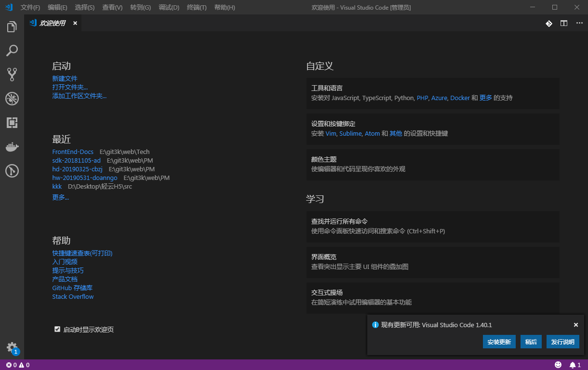
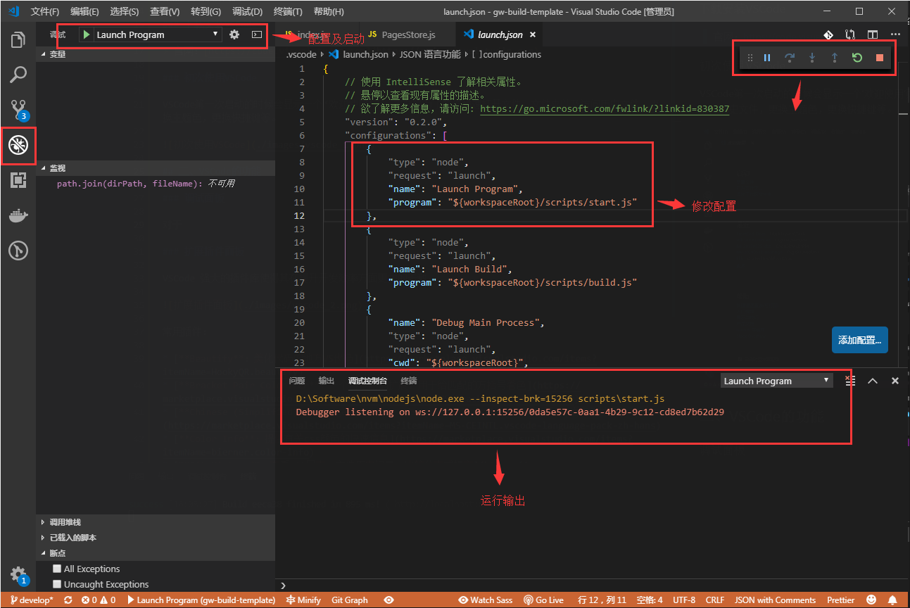
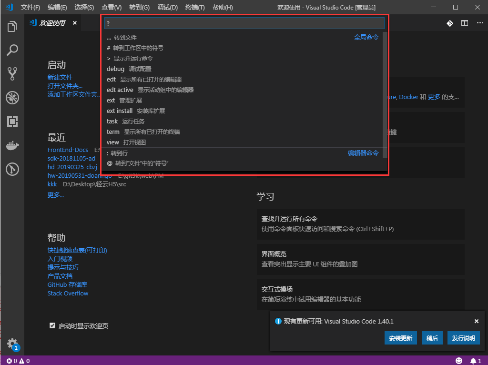

# VS Code

> VSCode：是一款免费的、开源的、高性能的、跨平台的、轻量级的代码编辑器，同时，在性能，语言支持、开源社区方面也做的很不错！

## 一、快速上手VSCode

### 安装与版本选择

VSCode有两个发布渠道，一个是常用的稳定版，每月发布一个主版本；另一个是insiders，每周一到周五早上6点发布，也是VSCode内部团队使用的版本，目的是为了更好的发现Bug。微软内部对这个做法还有个专门的名词：eat your own dog food(吃自己的狗粮)。

VSCode目前在全世界大概有一万五千名用户在使用insiders版本。不过刚接触VSCode，稳定版会相对适合。但是如果已经使用VSCode一段时间的话，可以试一试insiders。因为使用这个版本可以尽早用上最新的功能，一般VSCode的新功能会先在insiders上线，等运行一段时间后才会随着当月稳定版发布。改动较大的可能会运行两个月之后才会推向稳定版。

其次，一个新功能的添加往往是不成熟的，使用insiders可以第一时间再GitHub上反馈对新功能的看法及建议，甚至能为其提供代码。

### 下载安装VSCode

> 官网：[https://code.visualstudio.com](https://code.visualstudio.com)

### 初次使用VSCode

VSCode第一次启动的时候会显示一个‘欢迎使用’页，主要是为了方便快速打开文件，文件夹以及访问历史文件，更换主题色，更换快捷键等。

## 二、VSCode的功能

### 调试面板

对于Node.js、Dart、Docker等项目，我们可以使用调试面板进行调试，打断点，以及查看运行数据及堆栈等等。

### 版本控制面板 

使用Vscode，在界面内可以直接切换版本、拉取、提交代码，便于版本控制。

### 扩展插件面板

VSCode 强大的插件库使得其在提升开发效率方面更加的无敌。

常用插件：

* [**Beautify**：美化代码的地方VS代码](https://marketplace.visualstudio.com/items?itemName=HookyQR.beautify)
* [**Bracket Pair Colorizer**：一个可定制的扩展，用于给匹配的方括号着色](https://marketplace.visualstudio.com/items?itemName=CoenraadS.bracket-pair-colorizer)
* [**Chinese (Simplified) Language Pack for Visual Studio Code**：中文(简体)语言包扩展](https://marketplace.visualstudio.com/items?itemName=MS-CEINTL.vscode-language-pack-zh-hans)
* [**Color Info**：提供有关css颜色的快速信息](https://marketplace.visualstudio.com/items?itemName=bierner.color-info)
* [**Git History**：查看git日志、文件历史记录、比较分支或提交](https://marketplace.visualstudio.com/items?itemName=donjayamanne.githistory)
* [**gitflow**：在Visual Studio代码中集成和支持Gitflow](https://marketplace.visualstudio.com/items?itemName=vector-of-bool.gitflow)
* [**IntelliSense for CSS class names in HTML**：基于在工作空间中找到的定义，为HTML类属性完成CSS类名](https://marketplace.visualstudio.com/items?itemName=Zignd.html-css-class-completion)
* [**JS & CSS Minifier (Minify)**：很容易缩小ES5/ES6/ES7/ES8和CSS。支持缩小保存，缩小选择和自定义配置](https://marketplace.visualstudio.com/items?itemName=olback.es6-css-minify)
* [**Live Server**：为静态和动态页面启动带有实时重新加载功能的开发本地服务器](https://marketplace.visualstudio.com/items?itemName=ritwickdey.LiveServer)
* [**npm Intellisense**：在import语句中自动完成npm模块的Visual Studio代码插件](https://marketplace.visualstudio.com/items?itemName=christian-kohler.npm-intellisense)
* [**Path Intellisense**：自动完成文件名的Visual Studio代码插件](https://marketplace.visualstudio.com/items?itemName=christian-kohler.path-intellisense)
* [**Vetur**：用于VS代码的Vue工具](https://marketplace.visualstudio.com/items?itemName=octref.vetur)
* [**vscode-icons**：Visual Studio代码的图标](https://marketplace.visualstudio.com/items?itemName=vscode-icons-team.vscode-icons)
* [**Vue 2 Snippets**：一个Vue.js 2扩展](https://marketplace.visualstudio.com/items?itemName=hollowtree.vue-snippets)

### 命令面板

通过快捷键F1或者Ctrl+Shift+P（mac上的Cmd+Shift+P）键打开VSCode的命令面板。

VSCode的绝大部分命令都能从命令面板找到，所以只要熟悉命令面板，就能不用鼠标，完全使用键盘来完成编码工作。

## 三、VSCode快捷键进阶

* Ctrl+Shift+P,F1 展示全局命令面板
* Ctrl+P 快速打开最近打开的文件
* Ctrl+Shift+N 打开新的编辑器窗口
* Ctrl+Shift+W 关闭编辑器
* Ctrl + X 剪切
* Ctrl + C 复制
* Alt + up/down 移动行上下
* Shift + Alt up/down 在当前行上下复制当前行Ctrl + Shift + K 删除行
* Ctrl + Enter 在当前行下插入新的一行
* Ctrl + Shift + Enter 在当前行上插入新的一行
* Ctrl + Shift + | 匹配花括号的闭合处，跳转
* Ctrl + ] 或 [ 行缩进
* Home 光标跳转到行头
* End 光标跳转到行尾
* Ctrl + Home 跳转到页头
* Ctrl + End 跳转到页尾
* Ctrl + up/down 行视图上下偏移
* Alt + PgUp/PgDown 屏视图上下偏移
* Ctrl + Shift + [ 折叠区域代码
* Ctrl + Shift + ] 展开区域代码
* Ctrl + / 添加关闭行注释
* Shift + Alt +A 块区域注释
* Alt + Z 添加关闭词汇包含

**导航快捷键**

* Ctrl + T 列出所有符号
* Ctrl + G 跳转行
* Ctrl + P 跳转文件
* Ctrl + Shift + O 跳转到符号处
* Ctrl + Shift + M 或 Ctrl + J 打开问题展示面板
* F8 跳转到下一个错误或者警告
* Shift + F8 跳转到上一个错误或者警告
* Ctrl + Shift + Tab 切换到最近打开的文件
* Alt + left / right 向后、向前
* Ctrl + M 进入用Tab来移动焦点
* Ctrl + F 查询
* Ctrl + H 替换
* F3 / Shift + F3 查询下一个/上一个
* Alt + Enter 选中所有出现在查询中的
* Ctrl + D 匹配当前选中的词汇或者行，再次选中-可操作

**多行光标快捷键**

* Alt + Click 插入光标-支持多个
* Ctrl + Alt + up/down 上下插入光标-支持多个
* Ctrl + U 撤销最后一次光标操作
* Shift + Alt + I 插入光标到选中范围内所有行结束符
* Ctrl + I 选中当前行
* Ctrl + Shift + L 选择所有出现在当前选中的行-操作
* Ctrl + F2 选择所有出现在当前选中的词汇-操作
* Shift + Alt + right 从光标处扩展选中全行
* Shift + Alt + left 收缩选择区域
* Shift + Alt + (drag mouse) 鼠标拖动区域，同时在多个行结束符插入光标
* Ctrl + Shift + Alt + (Arrow Key) 也是插入多行光标的[方向键控制]
* Ctrl + Shift + Alt + PgUp/PgDown 也是插入多行光标的[整屏生效]
* Esc Esc 连续按两次Esc键取消多行光标
* Shift + Alt + F 格式化代码
* F12 跳转到定义处
* Alt + F12 代码片段显示定义
* Ctrl + K F12 在其他窗口打开定义处
* Ctrl + . 快速修复部分可以修复的语法错误
* Shift + F12 显示所有引用
* F2 重命名符号
* Ctrl + Shift + . / , 替换下个值

**编辑器管理快捷键**

* Ctrl + F4, Ctrl + W 关闭编辑器
* Ctrl + |切割编辑窗口
* Ctrl + 1/2/3 切换焦点在不同的切割窗口
* Ctrl + Shift + PgUp/PgDown 切换标签页的位置

**文件管理快捷键**

* Ctrl + N 新建文件
* Ctrl + O 打开文件
* Ctrl + S 保存文件
* Ctrl + Shift + S 另存为
* Ctrl + F4 关闭当前编辑窗口
* Ctrl + W 关闭所有编辑窗口
* Ctrl + Shift + T 撤销最近关闭的一个文件编辑窗口
* Ctrl + Enter 保持开启
* Ctrl + Shift + Tab 调出最近打开的文件列表，重复按会切换
* Ctrl + Tab 与上面一致，顺序不一致
* Ctrl + P 复制当前打开文件的存放路径
* Ctrl + R 打开当前编辑文件存放位置【文件管理器】

**显示快捷键**

* F11 切换全屏模式
* Ctrl + =/- 放大 / 缩小
* Ctrl + B 侧边栏显示隐藏
* Ctrl + Shift + E 资源视图和编辑视图的焦点切换
* Ctrl + Shift + F 打开全局搜索
* Ctrl + Shift + G 打开Git可视管理
* Ctrl + Shift + D 打开DeBug面板
* Ctrl + Shift + X 打开插件市场面板
* Ctrl + Shift + H 在当前文件替换查询替换
* Ctrl + Shift + J 开启详细查询
* Ctrl + Shift + V 预览Markdown文件【编译后】
* Ctrl + K v 在边栏打开渲染后的视图【新建】

**调试快捷键**

F9 添加解除断点
* F5 启动调试、继续
* F11 / Shift + F11 单步进入 / 单步跳出
* F10 单步跳过

**集成终端快捷键**

* Ctrl + ` 打开集成终端
* Ctrl + Shift + ` 创建一个新的终端
* Ctrl + C 复制所选
* Ctrl + V 复制到当前激活的终端
* Shift + PgUp / PgDown 页面上下翻屏
* Ctrl + Home / End 滚动到页面头部或尾部

## 四、VSCode中的鼠标操作

1. 在VSCode中，单击鼠标左键：把光标移动到响应的位置；双击鼠标左键：将当前光标下的单词选中；三击鼠标左键：选中当前行代码；四次点击鼠标左键：选中整个文档。
2. 鼠标左键单击行号：直接选中所在行；按住鼠标左键再行号上下移动：可以选中多行代码。
3. 拖动选中的代码，按住鼠标左键，移动鼠标可以改变代码位置；如果想在拖动时复制一份代码，可以按住Ctrl键，操作结果就能从原来的“剪切+复制”变成“复制+黏贴”。
4. VSCode中，如果鼠标拥有中键，只需要按下鼠标中键，然后对着一段文档拖出一个框，再框中的代码就被选中了，而且每一行选中的代码，都有一个独立的光标。
5. 悬停提示窗口：当鼠标移动到某些文件上之后，一会就会显示跟鼠标下文本相关的信息；如果鼠标放在某个函数上，按下Ctrl时，则能再悬停提示的窗口上看到该函数的实现。
6. 代码的跳转和链接：如果我们把鼠标放在函数上时，函数下方会出现一个下划线，然后当我们按下鼠标左键时，就能跳转到该函数的定义处。当我们再编写Markdown这样的非编程语言的文档时，通过Ctrl+鼠标左键能打开超级链接。