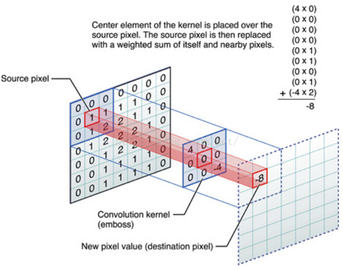
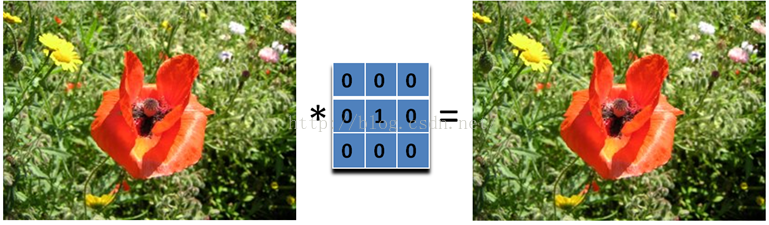
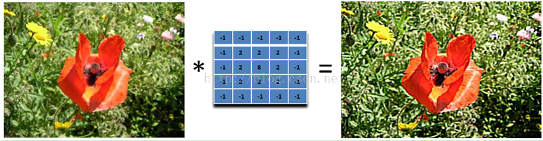
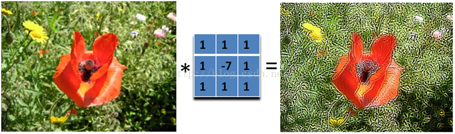
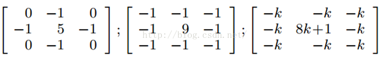
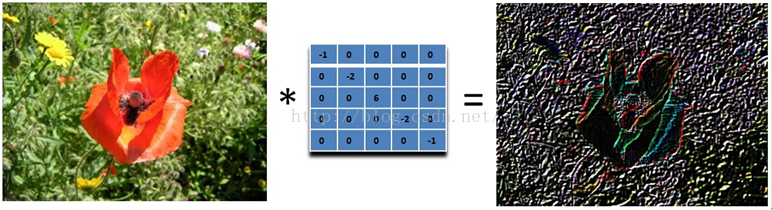
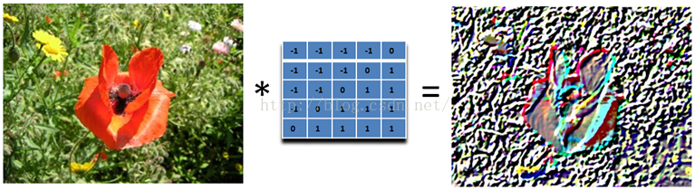
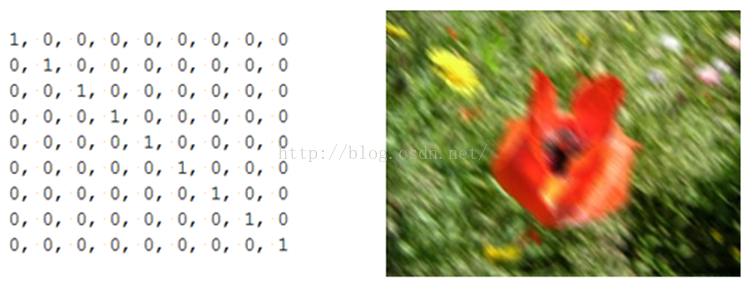
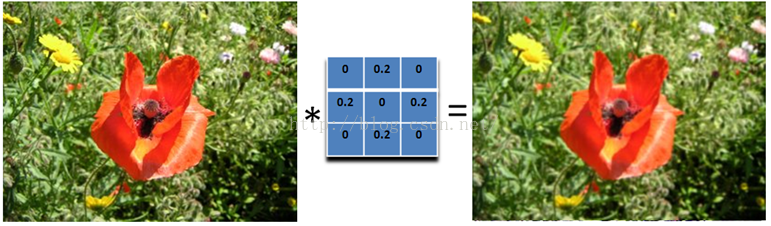

# 图像处理技术-空间像素篇

图像处理技术，归根到底就是对图像的每个像素进行离散化量化计算操作，我们都知道位图（矢量图除外）的每个像素点都有 4 个颜色值来决定，即 RGBA 四个维度值。

## 处理方式

图像处理的方式，主要分为 空间域 和 频域（光线频率的操作），一般的图像处理我们主要研究空间域上就行了

## 空间域

主要是逐像素操作 面向领域的操作，卷积计算操作和结合多幅图像的操作（即多张纹理采样计算）

## 基本原理



上图是图像处理最基本的方法，它可以允许我们对图像进行处理，产生很多不同的效果。做法很简单。首先，我们有一个二维的像素处理矩阵（有个高大上的名字叫卷积核）和一个要处理的二维图像。然后，对于图像的每一个像素点，计算它的邻域像素和滤波器矩阵的对应元素的乘积，然后加起来，作为该像素位置的值。这样就完成了像素处理过程

## 基本处理类型介绍

## 原原本本的输出

☻ 必要条件：中心点的值是 1。邻域点的权值都是 0



## 图像锐化

图像的锐化和边缘检测很像，首先找到边缘，然后把边缘加到原来的图像上面，这样就强化了图像的边缘，使图像看起来更加锐利了。这两者操作统一起来就是锐化滤波器了，也就是在边缘检测滤波器的基础上，再在中心的位置加 1，这样滤波后的图像就会和原始的图像具有同样的亮度了，但是会更加锐利。


我们把核加大，就可以得到更加精细的锐化效果



另外，下面的滤波器会更强调边缘：



主要是强调图像的细节。最简单的 3x3 的锐化滤波器如下：



大家应该也看出来了，锐化滤波器实际上就是计算当前点和周围点的差别，然后将这个差别加到原来的位置上。

## 边缘检测

我们要找水平的边缘：需要注意的是，这里矩阵的元素和是 0，所以滤波后的图像会很暗，只有边缘的地方是有亮度的。


为什么这个滤波器可以寻找到水平边缘呢？因为用这个滤波器卷积相当于求导的离散版本：你将当前的像素值减去前一个像素值，这样你就可以得到这个函数在这两个位置的差别或者斜率。下面的滤波器可以找到垂直方向的边缘，这里像素上和下的像素值都使用：


再下面这个滤波器可以找到 45 度的边缘：取-2 不为了什么，只是为了让矩阵的元素和为 0 而已。



那下面这个滤波器就可以检测所有方向的边缘:


为了检测边缘，我们需要在图像对应的方向计算梯度。用下面的卷积核来卷积图像，就可以了。但在实际中，这种简单的方法会把噪声也放大了。另外，需要注意的是，矩阵所有的值加起来要是 0.


## 浮雕

浮雕滤波器可以给图像一种 3D 阴影的效果。只要将中心一边的像素减去另一边的像素就可以了。这时候，像素值有可能是负数，我们将负数当成阴影，将正数当成光，然后我们对结果图像加上 128 的偏移。这时候，图像大部分就变成灰色了。

下面是 45 度的浮雕滤波器


我们只要加大滤波器，就可以得到更加夸张的效果了



## 运动模糊 Motion Blur

运动模糊可以通过只在一个方向模糊达到，例如下面 9x9 的运动模糊滤波器。注意，求和结果要除以 9。



这个效果就好像，摄像机是从左上角移动的右下角。

看了一些好玩的滤波器后我们可以进入主题了，首先来看均值模糊：

## 均值模糊 Box Filter (Averaging)

我们可以将当前像素和它的四邻域的像素一起取平均，然后再除以 5，或者直接在滤波器的 5 个地方取 0.2 的值即可，如下图：



可以看到，这个模糊还是比较温柔的，我们可以把滤波器变大，这样就会变得粗暴了：注意要将和再除以 13.


所以，如果你想要更模糊的效果，加大滤波器的大小即可。或者对图像应用多次模糊也可以。


## 高斯模糊

其实模糊滤波器就是对周围像素进行加权平均处理，均值模糊很简单，周围像素的权值都相同，所以不是很平滑。高斯模糊就有这个优点，所以被广泛用在图像降噪上。特别是在边缘检测之前，都会用来移除细节。那么下面我们就看看高斯模糊的权值是如何分配的。

## WebGL 实现

核算法可以推广到各种离散集合中，位图只是一种常见的像素集合，对于核算法，不同图形接口的实现方式大同小异，主要的区别是每个图形接口的性能及自带的一些计算特性，我们除了 webGL 之外也可以选择 Canvas 2D 图形接口来进行像素操作，下面我们以 webgl 图形接口为例来对以上图形算法在片元着色器进行简单的实现。

以上纹理作为演示例子 大小为 256 \* 256

### 基本片元模板

```cpp
precision mediump float;
uniform sampler2D sampler;
varying vec2 v_texcoord;
uniform float u_width;
uniform float u_height;
vec4 kernel(sampler2D sampler){
    //我们的处理函数TODO
}
void main (void)
{
 gl_FragColor = kernel(sampler);//获取处理过的像素
}
```

## WebGL 实现 - 无效果

```cpp
// 纹理大小 256 * 256
precision mediump float;
varying vec2 v_texcoord;
uniform sampler2D u_Sampler;
vec3 kernel(sampler2D sampler)
{
    // 单位像素纹理坐标大小量
    float unit_x=1./256.;
    float unit_y=1./256.;
    // 变换矩阵
    mat3 matrix=mat3(
        0.,0.,0.,
        0.,1.,0.,
    0.,0.,0.);
    // 正戏部分
    vec3 res=vec3(0.,0.,0.);
    float avgLength=0.;
    for(int i=0;i<3;i++)
    {
        for(int j=0;j<3;j++)
        {
            float factorX=1.;
            float factorY=1.;
            if(i<2)
            {
                factorX=-1.;
            }
            if(j<2)
            {
                factorY=-1.;
            }
            if(matrix[i][j]>0.){
                //计算有值的卷积和元素个数
                avgLength+=matrix[i][j];
            }

            float offsetX=factorX*(unit_x*float(i+1));

            float offsetY=factorY*(unit_y*float(j+1));


            vec2 samplerCoord=vec2(v_texcoord.x+offsetX,v_texcoord.y+offsetY);
            res+=vec3(texture2D(sampler,samplerCoord).rgb*matrix[i][j]);
        }
    }
    //平均像素操作 且设定阀值
    return clamp(res/avgLength,0.,1.);
}
void main(){
    gl_FragColor=vec4(kernel(u_Sampler),1.);
}
```

## WebGL 实现 - 锐化


```cpp
vec3 kernel(sampler2D sampler)
{
    // 单位像素纹理坐标大小量
    float unit_x=1./256.;
    float unit_y=1./256.;
    // 变换矩阵
    mat3 matrix=mat3(
        -1.,-1.,-1.,
        -1.,9.,-1.,
    -1.,-1.,-1.);
    // 正戏部分
    vec3 res=vec3(0.,0.,0.);
    float avgLength=0.;
    for(int i=0;i<3;i++)
    {
        for(int j=0;j<3;j++)
        {
            float factorX=1.;
            float factorY=1.;
            if(i<2)
            {
                factorX=-1.;
            }
            if(j<2)
            {
                factorY=-1.;
            }
            if(matrix[i][j]>0.){
                //计算有值的卷积和元素个数
                avgLength+=matrix[i][j];
            }

            float offsetX=factorX*(unit_x*float(i+1));
            float offsetY=factorY*(unit_y*float(j+1));


            vec2 samplerCoord=vec2(v_texcoord.x+offsetX,v_texcoord.y+offsetY);
            res+=vec3(texture2D(sampler,samplerCoord).rgb*matrix[i][j]);
        }
    }
    //平均像素操作 且设定阀值
    return clamp(res,0.,1.);
}
```

## WebGL 实现 - 边缘检测


```cpp
vec3 kernel(sampler2D sampler)
{
    // 单位像素纹理坐标大小量
    float unit_x=1./256.;
    float unit_y=1./256.;
    // 变换矩阵
    float matrix[25];
    for(int i=0;i<25;i++){
        matrix[i]=0.;
    }
    matrix[10]=-1.;
    matrix[11]=-1.;
    matrix[12]=2.;
    // 正戏部分
    vec3 res=vec3(0.,0.,0.);
    float avgLength=0.;
    for(int i=0;i<5;i++)
    {
        for(int j=0;j<5;j++)
        {
            float factorX=1.;
            float factorY=1.;
            if(i<2)
            {
                factorX=-1.;
            }
            if(j<2)
            {
                factorY=-1.;
            }
            if(matrix[(i*5)+j]>0.){
                //计算有值的卷积和元素个数
                avgLength+=matrix[(i*5)+j];
            }

            float offsetX=factorX*(unit_x*float(i+1));
            float offsetY=factorY*(unit_y*float(j+1));

            vec2 samplerCoord=vec2(v_texcoord.x+offsetX,v_texcoord.y+offsetY);
            res+=vec3(texture2D(sampler,samplerCoord).rgb*matrix[(i*5)+j]);
        }
    }
    //平均像素操作 且设定阀值
    return clamp(res,0.,1.);
}
void main(){
    gl_FragColor=vec4(kernel(u_Sampler),1.);
}
```

## WebGL 实现 - 浮雕

```cpp
vec3 kernel(sampler2D sampler)
{
        // 单位像素纹理坐标大小量
        float unit_x=1./256.;
        float unit_y=1./256.;
        // 变换矩阵
        mat3 matrix=mat3(
                2.,-0.,0.,
                -0.,-1.,0.,
        0.,0.,-1.);
        // 正戏部分
        vec3 res=vec3(0.,0.,0.);
        float avgLength=0.;
        for(int i=0;i<3;i++)
        {
                for(int j=0;j<3;j++)
                {
                        float factorX=1.;
                        float factorY=1.;
                        if(i<2)
                        {
                                factorX=-1.;
                        }
                        if(j<2)
                        {
                                factorY=-1.;
                        }
                        if(matrix[i][j]>0.){
                                //计算有值的卷积和元素个数
                                avgLength+=matrix[i][j];
                        }

                        float offsetX=factorX*(unit_x*float(i+1));
                        float offsetY=factorY*(unit_y*float(i+1));

                        vec2 samplerCoord=vec2(v_texcoord.x+offsetX,v_texcoord.y+offsetY);
                        res+=vec3(texture2D(sampler,samplerCoord).rgb*matrix[i][j]);
                }
        }
        //平均像素操作 且设定阀值
        return res;
}
```

## WebGL 实现 - 运动模糊


```cpp
// 运动模糊
vec3 kernel(sampler2D sampler)
{
    // 单位像素纹理坐标大小量
    float unit_x=1./256.;
    float unit_y=1./256.;
    // 变换矩阵
    float matrix[25];
    for(int i=0;i<25;i++){
        matrix[i]=0.;
    }
    matrix[0]=20.;
    matrix[6]=20.;
    matrix[12]=20.;
    matrix[18]=20.;
    matrix[24]=20.;
    // 正戏部分
    vec3 res=vec3(0.,0.,0.);
    float avgLength=0.;
    for(int i=0;i<5;i++)
    {
        for(int j=0;j<5;j++)
        {
            float factorX=1.;
            float factorY=1.;
            if(i<2)
            {
                factorX=-1.;
            }
            if(j<2)
            {
                factorY=-1.;
            }
            if(matrix[(i*5)+j]>0.){
                //计算有值的卷积和元素个数
                avgLength+=matrix[(i*5)+j];
            }

            float offsetX=factorX*(unit_x*float(i+1));
            float offsetY=factorY*(unit_y*float(j+1));

            vec2 samplerCoord=vec2(v_texcoord.x+offsetX,v_texcoord.y+offsetY);
            res+=vec3(texture2D(sampler,samplerCoord).rgb*matrix[(i*5)+j]);
        }
    }
    //平均像素操作 且设定阀值
    return clamp(res/avgLength,0.,1.);
}
```

## WebGL 实现 - 均值模糊


```cpp
// 均值模糊
vec3 kernel(sampler2D sampler)
{
    // 单位像素纹理坐标大小量
    float unit_x=1./256.;
    float unit_y=1./256.;
    // 变换矩阵
    mat3 matrix=mat3(
        10.,10.,10.,
        10.,10.,10.,
    10.,10.,10.);
    // 正戏部分
    vec3 res=vec3(0.,0.,0.);
    float avgLength=0.;
    for(int i=0;i<3;i++)
    {
        for(int j=0;j<3;j++)
        {
            float factorX=1.;
            float factorY=1.;
            if(i<2)
            {
                factorX=-1.;
            }
            if(j<2)
            {
                factorY=-1.;
            }
            if(matrix[i][j]>0.){
                //计算有值的卷积和元素个数
                avgLength+=matrix[i][j];
            }

            float offsetX=factorX*(unit_x*float(i+1));
            float offsetY=factorY*(unit_y*float(i+1));

            vec2 samplerCoord=vec2(v_texcoord.x+offsetX,v_texcoord.y+offsetY);
            res+=vec3(texture2D(sampler,samplerCoord).rgb*matrix[i][j]);
        }
    }
    //平均像素操作 且设定阀值
    return res/avgLength;

}
```

## 简要结论

卷积核范围越大，影响范围越广，迭代越加频繁，性能开销越大，效果越明显，决定模糊锐化等取样操作的程度

范围越小，影响范围越小，迭代少，性能损耗小，适合一些简单处理就很容易出效果的滤镜
