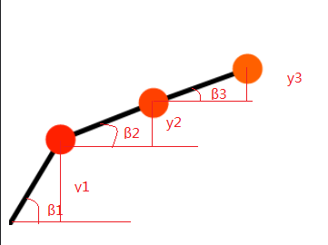
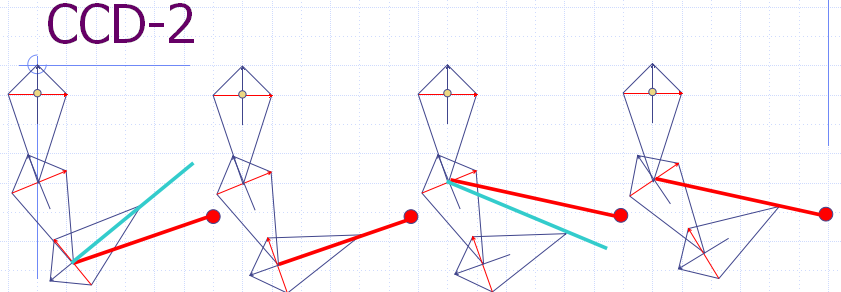

# 游戏里的反向运动学

## 前戏（正向运动学）

在介绍反向运动学之前，请允许我先介绍下正向运动学，
正向运动学是给定运动骨骼点的位置、旋转、缩放信息，计算出骨骼点的位置。
通俗来说是给定父骨骼位置以及它的变换来得出子骨骼的位置以及变换，打一个比方，就像运动手臂，可以带动手肘，进而带动手掌运动。正向运动学的概念是非常容易理解的，实现起来也比较方便，即在场景中先绘制父骨骼，应用父骨骼的变换，然后根据这个变换绘制子骨骼，以此类推。

## 通俗说法

所以正向运动，通俗点说就是对关节结构的正向使能，使各关节的运动角度和关节末端位置按照我们设定的量来移动。我们可以把各个关节想象成电动机，通过控制每个关节的电动机的转速，组合出一系列机械机构的动作。

## 一般方法论

实现正向运动的一般方法就是几何分析法，对于一个简单的铰链关节结构，我们可以画出如下示意图



## 代码简单实现

在以上示意图中，几何解析的转换一目了然，通过对几何关系的推导，我们可以定义一下抽象节点代码：

```javascript
function Node(angle) {
    this.prev = null
    this.next = null
    this.length = 100

    this.angle = 60 || angle
    this.startPos = {
        x: 0,
        y: 0
    }
    // 1rad = 57.32

    this.pos = {
        x: this.startPos.x + this.length * Math.cos(this.angle / 57.32),
        y: this.startPos.y + this.length * Math.sin(this.angle / 57.32)
    }
    this.update = function() {
        this.pos = {
            x: this.startPos.x + this.length * Math.cos(this.angle / 57.32),
            y: this.startPos.y + this.length * Math.sin(this.angle / 57.32)
        }
        console.log(this.pos)
        return this.pos
    }
}
```

然后就是初始化节点模型结构

```javascript
let bone1 = new Node(60)
bone1.update()
let bone2 = new Node(30)
bone1.next = bone2
bone2.startPos = bone1.pos
bone2.update()
let bone3 = new Node(15)
bone2.next = bone3
bone3.startPos = bone2.pos
bone3.update()
```

让后我们开始利用 canvas 2D 接口来进行渲染绘制

```javascript
function ud() {
    ctx.clearRect(0, 0, 600, 600)
    let head = bone1
    bone1.update()
    bone2.startPos = bone1.pos

    bone2.update()
    bone3.startPos = bone2.pos

    bone3.update()
    ctx.beginPath()
    ctx.moveTo(0, 600)
    ctx.lineWidth = 5
    while (head) {
        ctx.lineTo(head.pos.x, 600 - head.pos.y)

        // console.log(head)
        head = head.next
    }
    ctx.stroke()
    ctx.closePath()

    head = bone1
    let i = 1
    while (head) {
        ctx.fillStyle = '#FF' + String(i * 2) + '000'
        ctx.beginPath()
        ctx.arc(head.pos.x, 600 - head.pos.y, 15, 0, Math.PI * 2, true)
        ctx.closePath()
        ctx.fill()
        head = head.next
        i++
    }
}
```

我们绑定一些事件让其的关节手柄处可以拖动

```javascript
let isMove = false
let su = 0
let sy = 0
let info = null
let startAngle = 0
function down(e) {
    isMove = true
    su = e.offsetX
    sv = e.offsetY
    let colorMap = {
        '255|96|0|255': bone3,
        '255|64|0|255': bone2,
        '255|32|0|255': bone1
    }

    info = ctx.getImageData(e.offsetX, e.offsetY, 1, 1)
    if (colorMap[info.data.join('|')]) {
        startAngle = colorMap[info.data.join('|')].angle
    }
}
function move(e) {
    if (!isMove) {
        return
    }
    let colorMap = {
        '255|96|0|255': bone3,
        '255|64|0|255': bone2,
        '255|32|0|255': bone1
    }

    if (!colorMap[info.data.join('|')]) {
        return
    }
    let u = e.offsetX - su
    let v = e.offsetY - sv

    console.log(colorMap[info.data.join('|')])
    setAngle(startAngle - v * 0.5, colorMap[info.data.join('|')])
    ud()
}
function end() {
    isMove = false
    info = null
}
```

最终效果如下：（CodePen 传送门 [https://codepen.io/a931528933/pen/mddjWax](https://codepen.io/a931528933/pen/mddjWax)）
可以试着上下拖拽手柄改变关节角度

<iframe height="632" style="width: 100%;" scrolling="no" title="mddjWax" src="https://codepen.io/a931528933/embed/mddjWax?height=632&theme-id=default&default-tab=html,result" frameborder="no" allowtransparency="true" allowfullscreen="true"></iframe>

## 高潮（反向运动学 IK Inverse kinematics）

## 介绍

IK 在游戏里最常见的应用是 foot placement，就是当角色站在一个不平的表面上（台阶，斜坡）时，自动调整两脚的高低（当然，同时会影响小腿和大腿的姿态）以便看上去脚是真正“踩”在地面上的，而不是浮在空气中或者陷入地面以下。

## 方法论一 （CCD 循环坐标下降）
Cyclic Coordinate Descent (CCD) 是一个启发式的迭代搜索算法，它通过每一次只改变一个关节的参数来逐步减少位置误差和姿态误差，每个迭代过程包括一个从关节链结构的末端到基点的遍历过程。由于CCD 方法将多关节的关节链问题简化为单关节问题，可以用解析法处理，因此每一步的迭代可以相当快。当求得每个关节的参数 (转角)θ后，将其代入正向运动学方程求得末端效器和每个关节的位置。从运动链的末端开始 , 逐步改变每个关节的旋转角度。先是改变最末端的关节，末端关节到末段执行器的向量为图中蓝色线段，末端关节到目标点的向量为图中红色线段。求出 2 个向量的夹角α，让末端关节下的子链绕旋转轴转α角度，则末端执行器达到一个新位置。若没有达到目标，则继续取当前关节的上一关节，改变其旋转角度，直到选到根节点。若末端还没有达到目标位置，则又从末端关节开始新一轮运动，直到位置误差足够小或者到达了给定的循环次数。





该算法实现的关键实际上是边界问题，每一个关节是否已经到达临界约束的位置，如果到达，向父级迭代，如果没有满足条件，则继续改变当前关节的角度以及姿态。
在面对一些极端的情况，如骨骼完全伸直，需要做些细微量的修正，使其脱离极端边界，使迭代计算变得顺利

## CCD具体实现